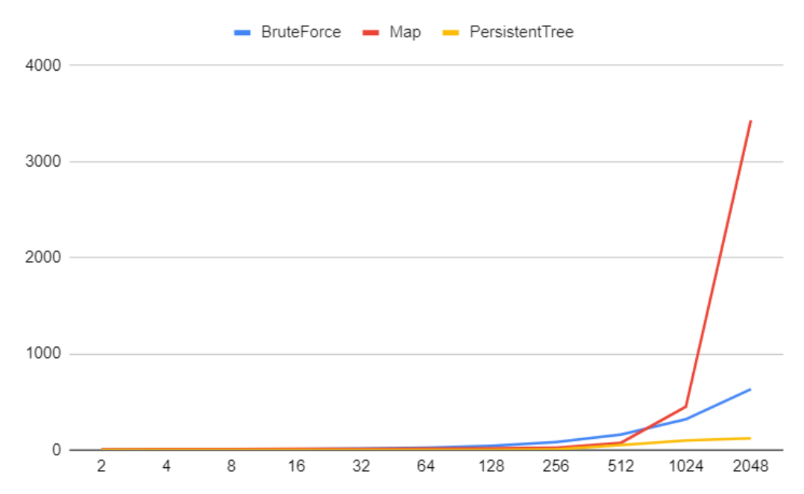

# Лабораторная работа №2
## Задача:
> Даны прямоугольники на плоскости с углами в целочисленных координатах. Требуется как можно быстрее выдавать ответ на вопрос «Скольким прямоугольникам принадлежит точка x, y?». Если точка находится на границе прямоугольника, то считается, что она принадлежит ему. Подготовка данных должна занимать как можно меньше времени.

## Цель:
### Сравнить рбаоту трёх алгоритмов поиска
- **Алгоритм перебора**
- **Поиск на карте**
- **Поиск с помощью персистентного дерева отрезков**

### Аккаунт на контесте
mamashkovtseva@edu.hse.ru

## Реализация:
### Алгоритм перебора
```c++
std::vector <int> BruteForce(std::vector <point>& points, std::vector <rectangle>& rectangles) {

    std::vector <int> count(points.size());

    for (int i = 0; i < points.size(); i++) {

        point p = points[i];

        for (int j = 0; j < rectangles.size(); j++) {
            rectangle r = rectangles[j];

            if ((p.x >= r.first.x) && (p.x < r.second.x) && (p.y >= r.first.y) && (p.y < r.second.y)) {
                count[i] += 1;
            }

        }

    }

    return count;

}
```
#### Сложность
| Сложность построения  | Сложность поиска   |
|-----------------------|--------------------|
| O(1)                  | O(N)                |

### Поиск на карте
```c++
class Map {

public:

    std::vector <int> x_array;
    std::vector <int> y_array;

    int binSearch(std::vector <int>& array, int target) {
        int left = 0;
        int right = array.size() - 1;
        while (left <= right) {
            int middle = (left + right) / 2;
            if (array[middle] > target) {
                right = middle - 1;
            } else if (array[middle] < target) {
                left = middle + 1;
            } else {
                return middle;
            }
        }
        return right;
    }

    std::vector <std::vector <int>> createMap(std::vector<rectangle>& rectangles) {

        std::set <int> x_set;
        std::set <int> y_set;

        for (int i = 0; i < rectangles.size(); i++) {
            x_set.insert(rectangles[i].first.x);
            x_set.insert(rectangles[i].second.x);
            y_set.insert(rectangles[i].first.y);
            y_set.insert(rectangles[i].second.y);
        }

        x_array = std::vector <int>(x_set.begin(), x_set.end());
        y_array = std::vector <int>(y_set.begin(), y_set.end());

        std::vector <std::vector <int>> compressMap = std::vector <std::vector <int>> (x_array.size(), std::vector<int>(y_array.size(), 0));

        for (int i = 0; i < rectangles.size(); i++) {

            int x1 = binSearch(x_array, rectangles[i].first.x);
            int y1 = binSearch(y_array, rectangles[i].first.y);
            int x2 = binSearch(x_array, rectangles[i].second.x);
            int y2 = binSearch(y_array, rectangles[i].second.y);

            for (int x = x1; x < x2; x++) {
                for (int y = y1; y < y2; y++) {
                    compressMap[x][y]++;
                }
            }

        }

        return compressMap;

    }

    std::vector <int> getMapValue(std::vector<point>& points, std::vector <std::vector <int>>& map) {

        std::vector <int> count;

        for (int i = 0; i < points.size(); i++) {
            int x = binSearch(x_array, points[i].x);
            int y = binSearch(y_array, points[i].y);
            count.push_back(map[x][y]);
        }

        return count;
    }

};
```
#### Сложность
| Сложность построения | Сложность поиска |
|----------------------|------------------|
| O(N^3)               | O(log(N))        |

### Поиск с помощью персистентного дерева отрезков
```c++
class segmentTree {

public:

    std::vector <int> arrayX;
    std::vector <int> arrayY;

    void createArrays(std::vector<rectangle>& rectangles) {
        std::set <int> x_set;
        std::set <int> y_set;

        for (auto & rectangle : rectangles) {
            x_set.insert(rectangle.first.x);
            x_set.insert(rectangle.second.x);
            y_set.insert(rectangle.first.y);
            y_set.insert(rectangle.second.y);
        }

        arrayX = std::vector <int>(x_set.begin(), x_set.end());
        arrayY = std::vector <int>(y_set.begin(), y_set.end());
    }

    struct Node {
        int value;
        int left_border;
        int right_border;
        Node* left_child;
        Node* right_child;

        Node(int val, int l, int r, Node* lc, Node* rc) : value(val), left_border(l), right_border(r), left_child(lc), right_child(rc) {}
    };

    struct Event {
        int x;
        int y_left;
        int y_right;
        int check;

        Event(int x, int y1, int y2, int c) : x(x), y_left(y1), y_right(y2), check(c) {}
    };

    Node* createTree(std::vector<int>& array, int left, int right) {

        if (right < left + 1) {
            return new Node(array[left], left, right, nullptr, nullptr);
        }

        int middle = (left + right) / 2;
        Node* left_child = createTree(array, left, middle);
        Node* right_child = createTree(array, middle + 1, right);
        return new Node(left_child->value + right_child->value, left_child->left_border, right_child->right_border, left_child, right_child);

    }

    Node* addNode(Node* node, int left, int right, int value){

        if (right < node->left_border || left > node->right_border)
            return node;

        if (left <= node->left_border && right >= node->right_border)
            return new Node(node->value + value, node->left_border, node->right_border, node->left_child, node->right_child);

        auto new_node = new Node(node->value, node->left_border, node->right_border, node->left_child, node->right_child);

        new_node->left_child = addNode(new_node->left_child, left, right, value);
        new_node->right_child = addNode(new_node->right_child, left, right, value);

        return new_node;
    }

    int binSearch(std::vector <int>& array, int target) {
        int left = 0;
        int right = array.size() - 1;
        while (left <= right) {
            int middle = (left + right) / 2;
            if (array[middle] > target) {
                right = middle - 1;
            } else if (array[middle] < target) {
                left = middle + 1;
            } else {
                return middle;
            }
        }
        return right;
    }

    std::vector<Node*> buildPersistTree(std::vector<rectangle>& rectangles) {

        if (rectangles.empty())
            return {};

        createArrays(rectangles);

        std::vector <Event> tree_events;

        for (auto & rectangle : rectangles) {
            int x1 = binSearch(arrayX, rectangle.first.x);
            int y1 = binSearch(arrayY, rectangle.first.y);
            int x2 = binSearch(arrayX, rectangle.second.x);
            int y2 = binSearch(arrayY, rectangle.second.y);

            tree_events.push_back(Event(x1, y1, y2 - 1, 1));
            tree_events.push_back(Event(x2, y1, y2 - 1, -1));
        }

        std::sort(tree_events.begin(), tree_events.end(), [](Event& a, Event& b) { return a.x < b.x; });

        std::vector <int> roots(arrayY.size());
        std::vector <Node*> tree_roots;
        auto root = createTree(roots, 0, arrayY.size()-1);
        int tmp = tree_events[0].x;
        for (auto & tree_event : tree_events) {
            if (tree_event.x != tmp) {
                tree_roots.push_back(root);
                tmp = tree_event.x;
            }
            root = addNode(root, tree_event.y_left, tree_event.y_right, tree_event.check);
        }
        return tree_roots;
    }

    int answer(Node* root, int index) {
        if (!root) return 0;
        int middle = (root->left_border + root->right_border) / 2;
        int value;
        if (index <= middle) value = answer(root->left_child, index);
        else
            value = answer(root->right_child, index);
        return value + root->value;
    }

    std::vector<int> treeAnswer(std::vector<Node*>& roots, std::vector<point>& points) {
        std::vector<int> count(points.size());

        int c = 0;
        for (auto & point : points) {
            int x = binSearch(arrayX, point.x);
            int y = binSearch(arrayY, point.y);
            if (x == -1 || y == -1) {
                c++;
                continue;
            }
            count[c++] = answer(roots[x], y);
        }
        return count;
    }

};
```
#### Сложность
| Сложность построения | Сложность поиска |
|----------------------|------------------|
| O(N*log(N))          | O(log(n))        |

## Тестирование

```c++
std::vector <point> newPoints(int n, int m) {
    std::vector <point> points;
    for (int i = 0; i < n; i++) {
        point newPoint;
        newPoint.x = rand() % (m * 20 + 1);
        newPoint.y = rand() % (m * 20 + 1);
        points.push_back(newPoint);
    }
    return points;
}

std::vector <rectangle> newRectangles(int n) {
    std::vector <rectangle> rectangles(n);
    for (int i = 0; i < n; i++) {
        rectangles[i].first = point(10 * i, 10 * i);
        rectangles[i].second = point(10 * (2 * n - i), 10 * (2 * n - i));
    }
    return rectangles;
}
```

## График


## Вывод

Первый алгоритм хорошо работает на небольшом количестве данных.
Второй алгоритм следует использовать в ситуации, когда мало прямоугольников и много точек, так как карта строится  долго, а на запросы код отвечает быстро.
Третий алгоритм работает эффективно на любом количестве данных.
